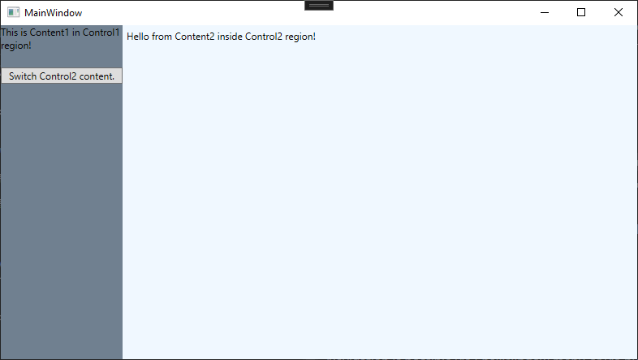
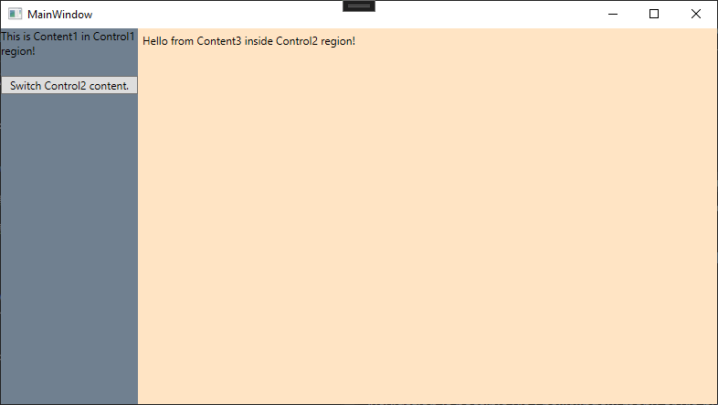

# WpfNavigation
   

## Description 
This library allows for simple adding of region navigation to WPF applications.

This means, you can navigate to different views (optionally with view models) in ContentControls.

## Download
You can acquire this library either directly via the NuGet package manager or by downloading it from the [NuGet Gallery](https://www.nuget.org/packages/philipp2604.WpfNavigation/).

## Quick Start
**I recommend having a look at the example project.**

1. Prepare your existing view by adding a `ContentControl` and registering it to the `RegionNavigationService` with a specific region key.
    - Registration of regions can be done by calling `RegionNavigationService.RegisterRegion(_YourRegionKey_, _YourContentControl_)`
    - Or by using the `NavigationService.NavigationRegion="_YourRegionKey_"` property inside the ContentControl's xaml.

2. Create the views that you want to navigate to.

3. Optionally, create view models for your views.
    - If needed, you can implement the `INavigationAware` interface in your view models, making them being notified when navigation occurs.

4. Register your views and view models to the `RegionContentService` with a specific content key.
    - Views-only are registered by calling `RegionContentService.RegisterContent<_YourViewType_>(_YourContentKey_)`.
    - If you want to register a view and a view model, you can call `RegionContentService.RegisterContent<_YourViewType_, _YourViewModelType_>(_YourContentKey_)`.

5. **Done!** You can now navigate to your views by simply calling `RegionNavigationService.Navigate(_YourRegionKey_, _YourContentKey_)`.

## Questions? Problems?
**Feel free to reach out!**

## Example screenshots
These screenshots show the example pages, included in the project.

## Ideas
* Add support for more Controls (Frames, ...).
## Third Party Software / Packages
Please have a look at [THIRD-PARTY-LICENSES](./THIRD-PARTY-LICENSES.md) for all the awesome packages used in this library.

## License
This library is [MIT licensed](./LICENSE.txt).